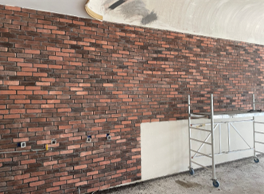
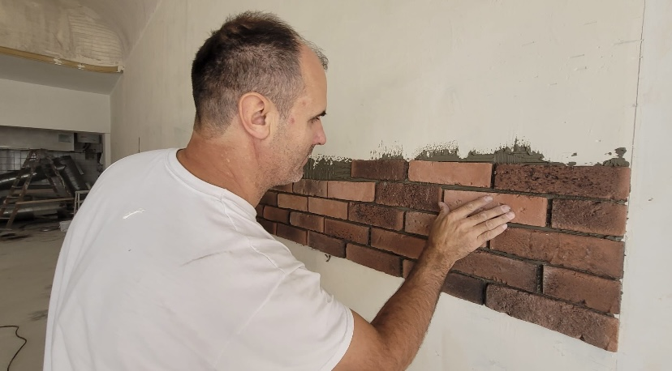
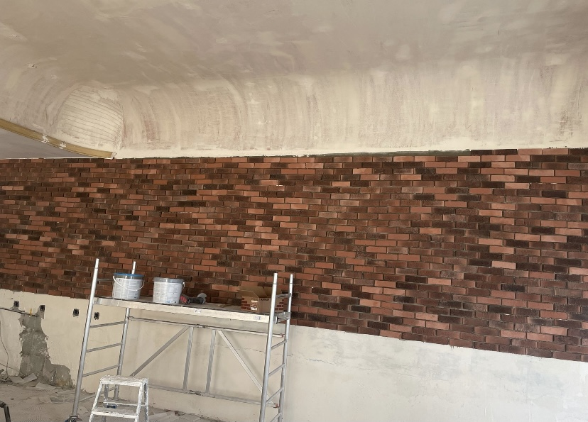

+++
title = "Fotos für unser Projekt"
date = "2021-11-16"
draft = false
pinned = false
image = "bild-wand.png"
description = ""
+++

An einem Dienstag hatte mein Vater einen Auftrag, wo er eine Wand eines Restaurants mit kleinen Ziegelsteinen dekorieren musste. Ich und Cedric durften ihm bei der Arbeit zusehen, und Bilder machen. Da wir keine professionelle Kameras hatten, nahmen wir unser Handy. Es ist zwar nur ein Auftrag den wir fotografieren konnten, aber in der Freizeit werden wir noch einige male für Fotos an seinen Arbeitsplatz fahren, damit wir viele verschiedene Angebote in seiner zukünftigen Webseite angeben können.