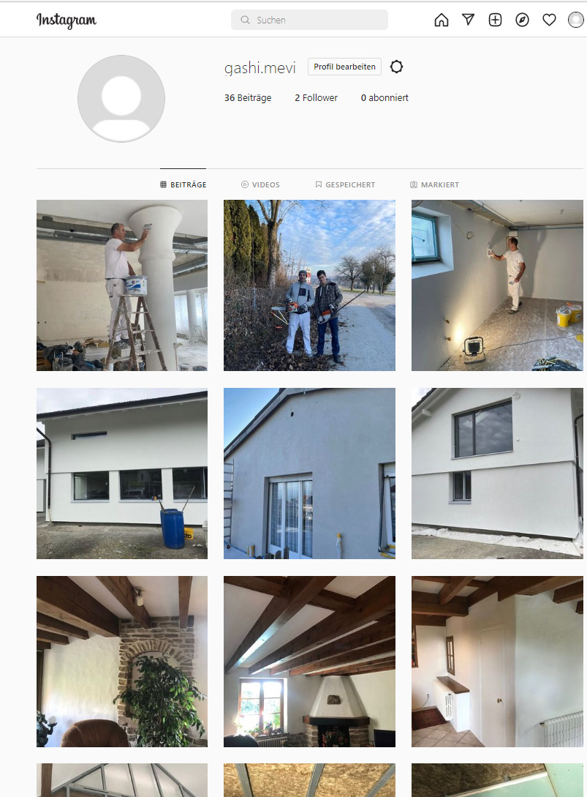
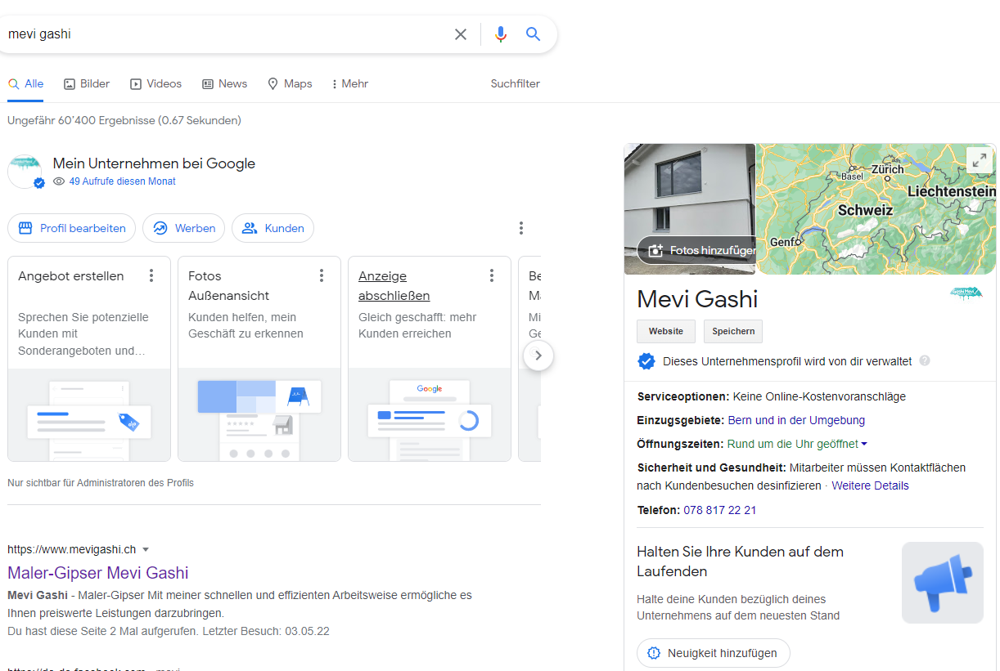

+++
title = "Unser Projekt"
date = "2022-05-03"
draft = true
pinned = true
image = "logo-websss.png"
footnotes = ""
+++
Am Anfang von unserem Schuljahr haben wir mit unserem Projekt angefangen. Zuerst war nur eine Webseite das Ziel, aber dann erweiterten wir unsere Ziele auf den Internetauftritt von Mevi Gashi. Ein Google Konto, eine Geschäftsemail und ein Instagram Konto wurden zusätzlich erstellt. Wir erhielten im Verlaufe der Wochen diverse Aufträge zu Verbesserungen, oder auch neue Bilder die wir in die Webseite einbauen konnten. Ein Auftrag war zB auch uns darüber zu informieren, wo man gute und günstige Etiketten für auf den Geschäftsbus machen lassen kann. Wir haben uns auch darüber informiert, wo man Visitenkarten drucken  lassen kann, denn mit der neuen Webseite, Emailadresse und dem Instagram Konto kommen neue Infos dazu, die auf seiner alten Karte nicht drauf waren. Wir hoffen, dass die erstellten Dinge ihm neue Kunden bringen werden.

**Webseite www.mevigashi.ch**

Wir erstellten die Webseite mit Wix.com. Zuerst hatten wir mit Carrd.co angefangen, aber das wurde dann zu kompliziert. Zudem hatte Carrd.co nicht die Features die wir gerne gehabt hätten. \
Wir mussten viele Entwürfe machen, viele Male die Position der Bilder wechseln, und auch lange überlegen was für Texte wir einfügen sollten. Es dauerte lange, bis wir endlich etwas vorzeigbares hatten. Etwas Probleme bereitete uns das Einfügen von Slideshow Galerien, um mehrere Bilder in einem Bild einzufügen. Es verrutschte immer wieder alles, und es dauerte lange bis wir herausfanden warum. Wir haben irgend einen Streifen eingefügt, der den Platz beanspruchte, den wir eigentlich für die Bilder brauchten. Wir merkten es aber nicht, da dieser durchsichtig war. Ein weiterer Punkt bei dem wir Mühe hatten war, für uns drei passende Termine zu finden, bei denen ich und Cedric mit zu seiner Baustelle durften um Bilder zu machen. Wir hatten auch mehrere Sitzungen, in denen wir besprachen was unser weiteres Vorgehen sein wird. Wir gingen auch einmal in unserer Freizeit, und durften das dann auch kompensieren

Als wir dann endlich fertig waren, waren wir mit dem Ergebnis  grundsätzlich zufrieden. Das einzige was mich ein wenig stört ist, dass die Webseite ziemlich leer aussieht. Dies kommt aber meiner Meinung nach von den Farben seines Logos ( Weiss und Hellblau ). Da der Hintergrund weiss ist, sieht es ein wenig aus als wäre es erst der Entwurf. Wenn man aber mehrere Bilde rund Texte hinzufügt, ist es dann aber überfüllt. Ich werde in der nächsten Zeit nach anderen Maler-Gipser Webseiten Googlen, und schauen, wie diese ihre Webseiten gestalten. Ich kann dann evtl. einige Dinge kopieren, oder ähnlich gestalten, damit die Webseite professioneller aussieht. Eine Option ist auch noch, den Hintergrund von weiss auf hellblau zu ändern, und die Schriftfarben anzupassen. Aber dies würde ich nur im schlimmsten Fall versuchen, denn weiss gefällt mir eigentlich viel besser, und eignet sich auch besser als Hintergrundfarbe. 

Das Ziel der Webseite ist es, neue Kunden zu finden, oder alte wieder an einen zu erinnern. Im Moment kommt auf der Google Startseite wenn man Mevi gashi eingibt seine Webseite und sein Unternehmensprofil. Somit können ihn alte Kunden finden, die seinen Namen kennen, aber neue noch nicht. Wir wollen als nächstes noch versuchen seinen Namen erscheinen zu lassen wenn man googelt "Maler Gipser Bern". Wir werden versuchen es mit dem Geschäftsstandort irgendwie einzustellen. \
Es gibt immer Verbesserungspotential, aber soweit finde ich, dass wir gute Arbeit geleistet haben. Es werden auch immer neue Bilder oder Texte dazu kommen. Ich werde mich auch nach Ende der BWD mit der Führung der Webseite beschäftigen.

**Instagram gashi.mevi**

Mit dem Instagram Konto haben wir erst später angefangen. Wir waren uns nicht sicher, ob es überhaupt eine gute Idee ist, und ob potentielle Kunden sich auf Instagram aufhalten. Es ist ja bekannt, das mehrheitlich Jugendliche auf den Sozialen Medien unterwegs sind.\
Facebook wäre aber auch eine Alternative gewesen, denn diese App ist auch bei den Älteren sehr beliebt, wenn nicht sogar mehr als bei den Jungen. Da mein Vater aber schon Facebook hat, haben wir uns trotzdem für Instagram entschieden. Mit 2 Facebook Konten würde es vielleicht für Verwirrung sorgen. Vielleicht würde man dann einen privaten Beitrag auf dem Geschäftskonto posten, oder umgekehrt. Und Instagram ist auch nicht gerade unbeliebt bei Unternehmen. Ich denke, dass in Zukunft auch immer mehr ältere Leute auf Instagram sein werden, denn es ist sehr ähnlich wie Facebook, und man kann dort zb Werbung fürs eigene Geschäft machen, oder auch Anbieter für diverse Bedürfnisse finden. Instagram ist auch sehr leicht zu bedienen, und man kann schnell auch Beiträge löschen, falls einem etwas nicht mehr gefällt.

Wir haben dann mehrere Bilder und Videos rausgesucht, die wir posten können. Wir mussten schauen, dass wir auch einige neue Bilder nehmen, und nicht nur die selben wie auf der Webseite. Nach langem Suchen habe ich dann die App Preview gefunden und auf dem Handy heruntergeladen, um dort einen Entwurf der Instagram Seite zu machen. Auf Preview kann man Bilder und Videos einfügen, und sie beliebig verschieben, um zu sehen, in welcher Reihenfolge die Bilder am besten aussehen. Ich musste mir noch überlegen, ob es schlau wäre, immer drei Bilder pro "Ereignis" zu posten, oder einfach mehrere Bilder als einen Beitrag zu posten (dass man swipen kann). Die Nachteile der ersten Version sind, dass man immer drei Bilder haben MUSS, weil sonst der Feed nicht mehr schön geordnet aussieht und die Reihenfolge kaputt geht. Bei der zweiten Version ist aber das Problem, dass es nach sehr wenig aussieht, wenn man nur 5 Beiträge hat, aber man swipen kann um andere Bilder zu sehen.\
Ich habe dann trotzdem die erste Variante genommen, also immer drei Bilder von einem Ereignis, oder drei ähnliche Bilder (von den Farben her, damit es immer noch passt, falls man nicht drei Bilder haben sollte).\
Ich habe den Entwurf meinem Vater gezeigt, und er fand es sehr gut. Ich postete alle Bilder die wir schon hatten heute. 

Es werden bestimmt immer neue Bilder dazu kommen, die ich posten kann. Bei Instagram ist es praktisch, dass man bei mehreren Konten angemeldet sein kann, ohne sich jedes mal neu anmelden zu müssen. Wir hoffen, dass potentielle Kunden auf die Seite aufmerksam werden. Um dies zu garantieren, haben wir uns überlegt ob wir bezahlte Werbung mit Instagram machen sollten, entschieden uns aber dann dagegen, weil es dann vielleicht doch nicht den richtigen Leuten angezeigt wird. 

**Google Konto**

Das Ziel war, dassMevi Gashi über die Suchmaschine gefunden werden kann. Er hat jetzt eine Geschäftsmail, und ein Google Konto. Wenn man ihn googelt, erscheint er ganz oben mit seiner Webseite. Wie oben schon erwähnt, wollen wir noch versuchen seine Seite erscheinen zu lassen wenn man nur Maler Gipser Bern eingibt.

**Übergabe**

Die Übergabe haben wir in den nächsten Woche geplant. Wir wollen ihm alle Passwörter etc. geben, und ihm erklären wie alles funktioniert, falls er was ändern will wenn ich keine Zeit habe. 

Wir haben sehr viele neue Dinge bei diesem Projekt gelernt, und ich fand es sehr spannend und abwechslungsreich. Ich bin froh, dass wir jemandem helfen konnten.